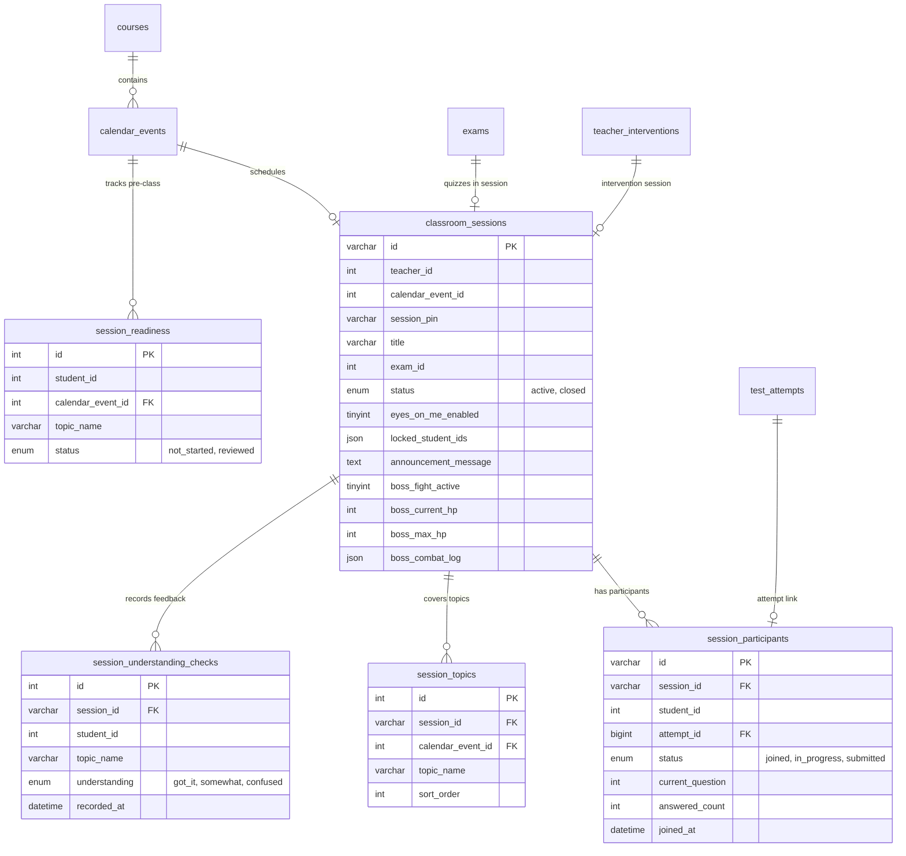

# Live Classroom Feature Map

> แผนผังโครงสร้างและความสัมพันธ์ของระบบห้องเรียนสด (Live Classroom / Live Session) ใน Nextbeyond  
> จัดทำขึ้นเพื่อการวิเคราะห์เชิงสถาปัตยกรรมระบบ (System Architecture Review) โดยละเอียด

---

## 1. Entry Points (จุดเริ่มต้นการเข้าใช้งาน)

### ฝั่งคุณครู / ผู้ดูแลระบบ (Teacher & Admin)
- **หน้ารวมเซสชันห้องเรียนสด:** [`admin/live-sessions.php`](file:///Applications/XAMPP/xamppfiles/htdocs/Nextbeyond/admin/live-sessions.php)
  - รายการห้องเรียนสดที่เปิดอยู่ (Active Session Card) พร้อม PIN, จำนวนนักเรียน, ปุ่มเข้าสู่ห้อง
  - ประวัติห้องเรียนสดย้อนหลัง (Closed Sessions History)
  - โมดอลสร้างห้องเรียนสดใหม่ (Create Session Modal) พร้อมเลือกว่าจะผูกกับ Calendar Event หรือ Course ใด
  - หน้าจอฉายโปรเจกเตอร์ด่วน (Projector View)
- **ห้องควบคุมการสอนสด (Teacher Command Center):** [`admin/live-session-room.php?id={sessionId}`](file:///Applications/XAMPP/xamppfiles/htdocs/Nextbeyond/admin/live-session-room.php)
  - แผงควบคุมสดแบบรวมศูนย์ (PIN Display, Eyes On Me Global Switch & Per-Student Accordion)
  - บัตรเช็กความเข้าใจผู้เรียน (Phase 2 Class Understanding Card)
  - ภาพรวมข้อสอบ (Exam Overview)
  - 9 แผงการทำงาน (Student Details, Attendance, Urgent Announcement, Remediation Hub, Exam Stats, Skill Map, Missed Questions, Reset Attempt, Post-Class Assignment)
  - สถานะผู้เรียนแบบ Live Pills
- **ปฏิทินตารางสอน (Calendar Integration Entry):** [`admin/calendar.php`](file:///Applications/XAMPP/xamppfiles/htdocs/Nextbeyond/admin/calendar.php) / [`assets/js/admin-calendar.js`](file:///Applications/XAMPP/xamppfiles/htdocs/Nextbeyond/assets/js/admin-calendar.js)
  - เมื่อเปิดดู Event คาบเรียน จะมีปุ่ม `🟢 เข้าห้องเรียนสด (PIN)` หรือ `🔴 เริ่ม Live Session` ซึ่งส่งต่อไปยัง `live-sessions.php?calendarEventId={id}`

### ฝั่งนักเรียน (Student Portal)
- **หน้าหลักนักเรียน (Dashboard):** [`student/index.php`](file:///Applications/XAMPP/xamppfiles/htdocs/Nextbeyond/student/index.php)
  - แถบแจ้งเตือนสด: `🔴 ห้องเรียนสดเปิดอยู่แล้ว — PIN: XXXXXX` นำทางตรงไปยัง `student/live-session.php?pin=XXXXXX`
- **หน้าเตรียมตัวก่อนเรียน (Pre-Class Readiness):** [`student/get-ready.php?event_id={id}`](file:///Applications/XAMPP/xamppfiles/htdocs/Nextbeyond/student/get-ready.php)
  - แสดงหัวข้อประจำคาบ (Topic Checklist) และปุ่ม `เข้าห้องเรียนเลย` พร้อม PIN เมื่อเซสชันเปิด
- **หน้าล็อบบี้และกรอก PIN เข้าร่วม:** [`student/live-session.php`](file:///Applications/XAMPP/xamppfiles/htdocs/Nextbeyond/student/live-session.php)
  - **โหมดไม่มีเซสชัน (PIN Entry):** ช่องกรอก PIN 6 หลักแบบอินเทอร์แอคทีฟ
  - **โหมดอยู่ในห้องเรียน (Lobby):** แสดงหัวข้อประจำคาบ, ลิงก์ห้องเรียนวิดีโอคอล (Google Meet / Zoom / Onsite Location), กล่องประกาศสดจากครู, ปุ่มเริ่มทำข้อสอบสด, มินิบอร์ดเช็กความเข้าใจแบบป๊อปอัพ
- **หน้าทำข้อสอบสดประจำคาบ:** [`student/take-test.php?id={examId}&sessionId={sessionId}`](file:///Applications/XAMPP/xamppfiles/htdocs/Nextbeyond/student/take-test.php)
  - ทำข้อสอบพร้อมจับเวลา, เชื่อมโยงกับ `session_participants`, ล็อกจอตาม Eyes On Me, รับประกาศสด, และส่งข้อสอบอัตโนมัติหากครูปิดเซสชัน
- **หน้าสรุปผลสอบ:** [`student/test-result.php?id={attemptId}&sessionId={sessionId}`](file:///Applications/XAMPP/xamppfiles/htdocs/Nextbeyond/student/test-result.php)
  - แสดงผลคะแนนพร้อมปุ่ม "← กลับหน้าห้องเรียนสด"

---

## 2. Frontend Components & Architecture

### ครู (Teacher Interface)
- **UI Engine:** Vanilla JavaScript + Tailwind CSS (ไม่มี Framework เช่น React ใน Live Session ส่วนนี้ เป็น Server-rendered PHP + Client JS Module)
- **JS Controller:** [`assets/js/live-session-teacher.js`](file:///Applications/XAMPP/xamppfiles/htdocs/Nextbeyond/assets/js/live-session-teacher.js)
  - Web Audio Synthesizer (สร้างเสียงเอฟเฟกต์ 8-bit สำหรับการแจ้งเตือน, การโจมตีบอส, ชัยชนะ)
  - Modal Manager: จัดการ Modal แบบ Dynamic Content (Exam Overview, Attendance + Thai CSV Export, Urgent Announcement, Remediation, Stats, Skill Map, Reset Attempt, Post-Class Quick Assign, Boss Arena Fullscreen)
  - Eyes On Me Controller (Global Lock & Per-Student Selective Lock)
  - Understanding Check Broadcaster (ส่งคำสั่ง `_check_{topic}` ผ่าน Announcement Channel)

### นักเรียน (Student Interface)
- **UI Engine:** Vanilla JavaScript, Tailwind CSS, Google Fonts (IBM Plex Sans Thai, Inter)
- **Inline Controllers:** [`student/live-session.php`](file:///Applications/XAMPP/xamppfiles/htdocs/Nextbeyond/student/live-session.php), [`student/take-test.php`](file:///Applications/XAMPP/xamppfiles/htdocs/Nextbeyond/student/take-test.php)
  - PIN Input Segment Controller (จัดการ Auto-focus และการแบ่งหลัก PIN 6 ช่อง)
  - Eyes On Me Fullscreen Lock Overlay (`#eyes-on-me-overlay` z-index 50 ล็อกหน้าจอทันทีเมื่อสถานะเปลี่ยน)
  - Live Understanding Pop-up (`#understanding-panel` สำหรับกด 👍 เข้าใจแล้ว / 😐 บางส่วน / 🤷 ยังไม่เข้าใจ)
  - Auto-submit on Session Termination Controller

---

## 3. State Management

ระบบไม่ใช้ Redux หรือ React Context เพราะทำงานบน Vanilla JS โดยใช้ **Local State + Polling Synchronizer**:
- **Teacher State (`live-session-teacher.js`):**
  - `sessionData`: Object ข้อมูลเซสชันทั้งหมดที่ได้จาก API (session, students, questions, questionStats, understandingStats, bossCombatLog)
  - `activeModalKey`: รหัสโมดอลปัจจุบัน
  - `isLockAccordionOpen`: สถานะเปิด/ปิดรายชื่อล็อกนักเรียนรายบุคคล
  - `battleSoundEnabled`: เปิด/ปิด Web Audio FX
- **Student State (`live-session.php` & `take-test.php`):**
  - `currentSessionId`, `ATTEMPT_ID`
  - `lastAnnouncement`: จดจำข้อความประกาศล่าสุดเพื่อเช็กความเปลี่ยนแปลง
  - `answers` (ใน `take-test.php` เก็บคำตอบใน Local Memory และ `localStorage` เพื่อกันข้อมูลหาย)

---

## 4. Backend (API Endpoints & Controllers)

### 1. Teacher APIs: [`admin/live-sessions-api.php`](file:///Applications/XAMPP/xamppfiles/htdocs/Nextbeyond/admin/live-sessions-api.php)
- `GET live-sessions-api.php?sessionId={id}`: ดึงรายละเอียดเซสชันทั้งหมด, ข้อสอบ, สถิตินักเรียนรายคน, สถิติคำถามที่ตอบผิด, ความเข้าใจชั้นเรียน, ข้อมูลบอส
- `GET live-sessions-api.php`: แสดงรายการเซสชันทั้งหมดของครูและข้อสอบที่เลือกเปิดได้
- `POST live-sessions-api.php` (สร้างห้องใหม่): สร้าง `classroom_sessions`, สุ่ม PIN 6 หลัก, ผูก `calendar_event_id`, ปิดเซสชันอื่นที่ค้างอยู่ของครูท่านนั้น
- `POST live-sessions-api.php?action=reset_student_attempt`: รีเซ็ตการทำข้อสอบของนักเรียนรายคน (ลบ `test_answers` และ `test_attempts`, ปรับสถานะเป็น `joined`)
- `POST live-sessions-api.php?action=follow_up_intervention`: สร้างรายการติดตามเดี่ยว (Intervention) สำหรับนักเรียนที่มีปัญหาในคาบ
- `POST live-sessions-api.php?action=teacher_strike`: ครูโจมตีลดเลือดบอส (-25 HP)
- `POST live-sessions-api.php?action=reset_boss`: รีเซ็ตเลือดบอส
- `POST live-sessions-api.php?action=setup_boss`: ตั้งค่าธีมบอสและคะแนนรางวัล
- `PATCH live-sessions-api.php`: อัปเดตสถานะเซสชัน (active/closed), ล็อกจอ Eyes On Me, ส่งประกาศด่วน, อัปเดตเลือดบอส
- `DELETE live-sessions-api.php?sessionId={id}`: ลบเซสชันและผู้เข้าร่วม
- `DELETE live-sessions-api.php?action=delete_all_closed`: ล้างประวัติเซสชันที่ปิดแล้วทั้งหมด

### 2. Student APIs: [`student/live-session-api.php`](file:///Applications/XAMPP/xamppfiles/htdocs/Nextbeyond/student/live-session-api.php)
- `GET live-session-api.php?action=status&sessionId={id}&currentQ={q}&answered={a}&attemptId={att}`: ดึงสถานะห้องสด, ตรวจสอบการล็อกจอ Eyes On Me, ข้อความประกาศ, ตรวจสอบว่าถูกสั่งรีเซ็ตข้อสอบหรือไม่, แจ้งความคืบหน้าการทำข้อสอบของนักเรียนขึ้นเซิร์ฟเวอร์
- `POST live-session-api.php?action=join`: เข้าร่วมห้องผ่าน PIN 6 หลัก, บันทึกหรือตรวจสอบ `session_participants`, ตรวจจับการอนุญาตให้เข้าห้องสาย (`allow_late_join`)
- `POST live-session-api.php?action=leave`: ออกจากห้องเรียน (ลบสถานะ `joined`)
- `POST live-session-api.php?action=deal_damage`: โจมตีบอสเมื่อตอบคำถามถูกต้อง
- `POST live-session-api.php?action=understanding_check`: บันทึกผลเช็กความเข้าใจ (`got_it`, `somewhat`, `confused`)

### 3. Preparation APIs: [`student/get-ready-api.php`](file:///Applications/XAMPP/xamppfiles/htdocs/Nextbeyond/student/get-ready-api.php)
- `GET get-ready-api.php?event_id={id}`: ดึงสถานะความพร้อมและหัวข้อย่อยก่อนเรียน
- `POST get-ready-api.php`: บันทึกการทบทวนหัวข้อ (`reviewed` / `not_started`)

---

## 5. Realtime Architecture (ระบบข้อมูลสด)

- **เทคโนโลยีที่ใช้จริง:** **HTTP Client-Side Polling (Short Polling)**
  - *เหตุผล:* ออกแบบมาให้ทำงานบนโฮสติ้ง PHP ทั่วไป (Shared Hosting / Apache / Nginx + PHP-FPM) โดยไม่ต้องใช้เซิร์ฟเวอร์ WebSocket แยกต่างหาก
  - **รอบการ Polling ของคุณครู:** ทุก **3,000 ms** (3 วินาที) ผ่าน `setInterval` ใน `live-session-teacher.js`
  - **รอบการ Polling ของนักเรียน (หน้าล็อบบี้):** ทุก **2,500 ms** (2.5 วินาที) ผ่าน `setInterval` ใน `live-session.php`
  - **รอบการ Polling ของนักเรียน (หน้าทำข้อสอบ):** ทุก **3,000 ms** (3 วินาที) ผ่าน `setInterval` ใน `take-test.php`
- **กลไกการส่งสัญญาณเสมือน Real-time (Virtual Real-time Events):**
  - **Screen Lock (Eyes On Me):** ผ่านฟิลด์ `eyes_on_me_enabled` และ `locked_student_ids`
  - **Urgent Announcement:** ผ่านฟิลด์ `announcement_message`
  - **Check Understanding Trigger:** ส่งสัญญาณพิเศษ `_check_{topic_name}` ผ่าน `announcement_message` เมื่อ client ตรวจพบ prefix นี้ จะเปิดหน้าต่างเช็กความเข้าใจทันที
  - **Reset Attempt Signal:** ตรวจจับผ่านการเปรียบเทียบ `clientAttemptId` กับฐานข้อมูล หากค่าใน DB ถูกลบ Client จะได้รับแฟล็ก `resetAttempt: true` แล้วสั่งรีเฟรชหน้าจอข้อสอบใหม่
  - **Class Terminated Signal:** แฟล็ก `sessionClosed: true` ส่งผลให้หน้านักเรียน Auto-submit ข้อสอบและเด้งกลับหน้าหลัก

---

## 6. Database Tables & Relationships



---

## 7. External & Internal Integrations

| ระบบ | ไฟล์ที่เชื่อมโยง | รายละเอียดการทำงาน |
|---|---|---|
| **Calendar (ตารางเรียน)** | `includes/phase2-session-service.php`, `admin/calendar-api.php` | เชื่อม Event วันที่/เวลา/ห้องเรียน เข้ากับ `classroom_sessions.id` |
| **Get Ready (เตรียมตัวก่อนเรียน)** | `student/get-ready.php`, `student/get-ready-api.php` | Checklist หัวข้อก่อนเรียน พร้อมปุ่มนำทางเข้า Live Session เมื่อคาบเปิด |
| **Exam Engine (ระบบสอบ)** | `student/take-test.php`, `student/submit-test.php`, `student/test-result.php` | ทำข้อสอบแบบจับเวลาในห้องเรียนสด ตรวจผลทันที |
| **Topic Mastery (ทักษะสะสม)** | `includes/phase2-session-service.php` (`syncUnderstandingToMastery`) | เมื่อปิดห้องเรียนสด ระบบจะแปลงผลความเข้าใจ (`got_it`=75%, `somewhat`=50%, `confused`=20%) อัปเดตเข้าตาราง `topic_mastery` |
| **Remediation & Intervention** | `includes/phase5-mastery-service.php`, `admin/adaptive-learning-api.php` | คิวช่วยเหลือผู้เรียน สามารถนัดหมายคาบสอนสดพิเศษเพื่อแก้ Learning Gap รายคน |
| **Post-Class Assignment** | `includes/phase3-mastery-service.php`, `admin/worksheets-api.php` | มอบหมายการบ้าน/ใบงานเชื่อมกับ `session_id` อัตโนมัติ |
| **Gamification / Reward Points** | `includes/live-sessions-helper.php` (`awardBossDefeatPoints`) | บันทึกพอยต์เข้า `nc_point_transactions` ให้ผู้เรียนทุกคนเมื่อพิชิตบอส |
| **Learning Path / Roadmap** | `student/learning-path.php`, `includes/phase5-mastery-service.php` | แสดงตารางห้องเรียนสดที่กำลังจะถึงในแผนการเรียน |

---

## 8. Main User Flow (Implementation จริง)

### ครู (Teacher Flow)
```
1. เปิดหน้า live-sessions.php หรือเปิดผ่าน Calendar (calendar.php)
   ↓
2. กด "สร้างห้องเรียนสดใหม่" เลือกชื่อคาบ, กำหนดเวลา, ข้อสอบที่ต้องการวัดผล, และ Event ที่เกี่ยวข้อง
   ↓
3. ระบบสร้างห้อง, ออกรหัส PIN 6 หลัก และเปิดสถานะ 'active' (พร้อมปิดเซสชันเก่าของครูอัตโนมัติ)
   ↓
4. เข้าสู่หน้าห้องควบคุมสด (live-session-room.php?id=...)
   ↓
5. แจก PIN 6 หลัก หรือเปิดจอโปรเจกเตอร์ใหญ่ให้นักเรียนดู
   ↓
6. นักเรียนทยอยเข้าห้อง ครูดูสถานะสดผ่าน Live Student Pills
   ↓
7. ระหว่างสอน:
   - กดสวิตช์ "Eyes On Me" เพื่อหยุดจอนักเรียนชั่วคราวให้ตั้งใจฟังหน้าห้อง
   - หรือล็อกจอเฉพาะรายบุคคลผ่านเมนู Accordion
   - ส่งข้อความประกาศด่วน (Urgent Announcement)
   - กดปุ่ม "📢 เช็กความเข้าใจ" ส่งสัญญาณถามความเข้าใจนักเรียนทุกคน
   - เปิดบอสไฟท์ (Boss Arena) กระตุ้นการตอบคำถามถูก
   - ตรวจดูคำถามที่ตอบผิดมากที่สุด (Missed Questions) แบบเรียลไทม์
   - รีเซ็ตข้อสอบให้นักเรียนที่ต้องการทำใหม่ (Reset Attempt)
   ↓
8. มอบหมายการบ้านหลังเรียน (Post-Class Assignment) ผ่านโมดอลเชื่อมกับคลังใบงาน
   ↓
9. เช็คชื่อและดาวน์โหลดรายงานการเข้าเรียนเป็นไฟล์ CSV (Excel ภาษาไทย)
   ↓
10. สิ้นสุดเซสชัน (End Session): ระบบปิดห้อง, ทำการ Auto-submit คำตอบนักเรียนทุกคนที่ยังค้างอยู่, และซิงก์ความเข้าใจเข้าสู่ตาราง Topic Mastery
```

### นักเรียน (Student Flow)
```
1. ดูตารางเรียนหรือเตรียมตัวก่อนเรียนที่หน้า get-ready.php (ทบทวนหัวข้อย่อย)
   ↓
2. เมื่อครูเปิดห้อง จะมีแถบเตือนสีแดงบนหน้าแรก (index.php) หรือหน้า get-ready.php พร้อมรหัส PIN
   ↓
3. เข้าสู่ student/live-session.php กรอก PIN 6 หลัก
   ↓
4. ระบบบันทึกลง session_participants และนำทางเข้าสู่ "Live Classroom Lobby"
   ↓
5. ในล็อบบี้:
   - ดูหัวข้อที่จะเรียน, ลิงก์ห้องเรียนวิดีโอ (Google Meet / Zoom / Onsite)
   - ดูประกาศสดจากคุณครู
   - กดปุ่ม "ทำแบบทดสอบสด" เพื่อเข้าสู่ take-test.php?sessionId=...
   ↓
6. ระหว่างทำข้อสอบ / เรียนสด:
   - หน้าระบบจะ Polling ทุก 2.5-3 วินาที
   - หากครูกด Eyes On Me หน้าจอจะถูกล็อกด้วยม่านสีดำทันที
   - หากมีประกาศด่วนหรือการเช็กความเข้าใจ จะมีแถบหรือหน้าต่างเด้งขึ้นมาให้กดประเมินตนเอง
   - หากครูกดรีเซ็ตสิทธิ์ หน้าจอจะล้างข้อมูลและให้เริ่มทำใหม่
   ↓
7. ส่งข้อสอบ (Submit) หรือระบบ Auto-submit เมื่อหมดเวลาหรือครูสั่งปิดห้อง
   ↓
8. ดูผลคะแนนที่ test-result.php พร้อมปุ่มนำทางกลับหน้าห้องเรียนสด
```
