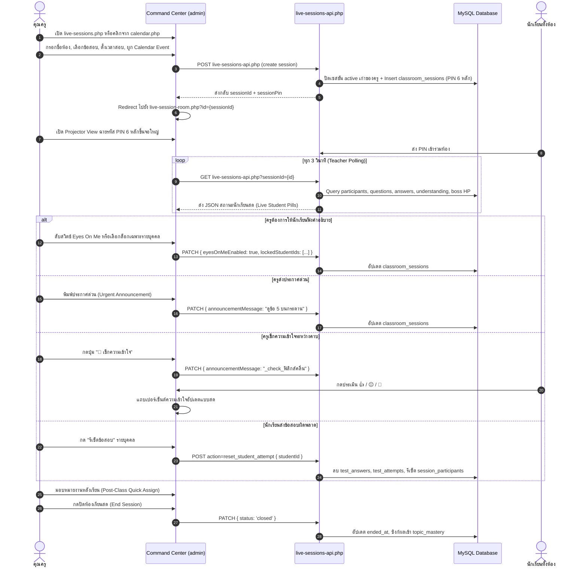
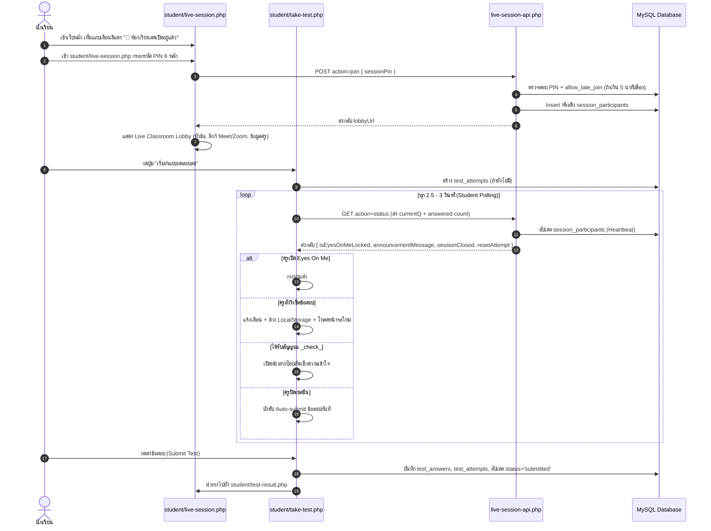
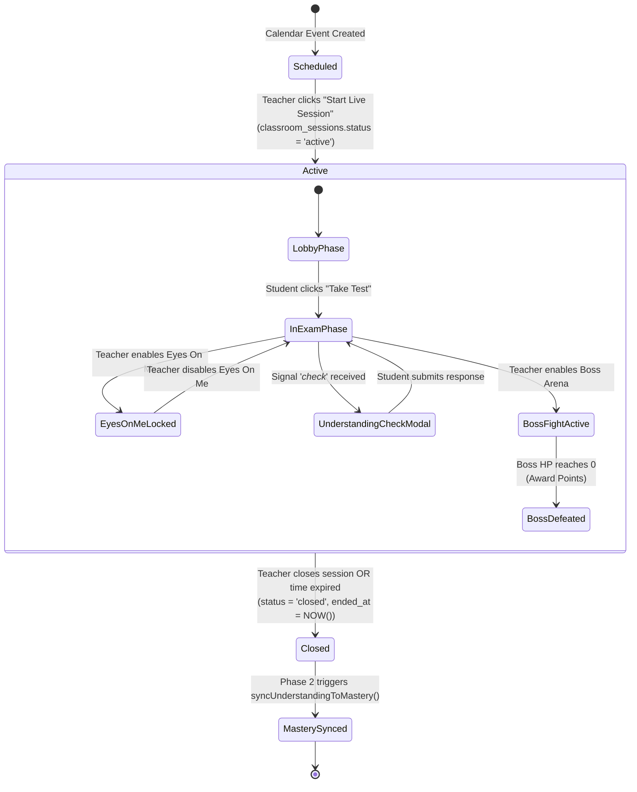

# Nextbeyond Live Classroom: Full Code Audit & Target Architecture Specification

> **เอกสารรายงานผลการตรวจสอบโค้ดเชิงลึก (Code Audit) และข้อกำหนดสถาปัตยกรรมเป้าหมาย (Target Architecture Specification)**  
> โครงการ: Nextbeyond — Live Classroom / Live Session Platform  
> จัดทำสำหรับ: สถาปนิกซอฟต์แวร์, ทีมวิศวกรรม, และการวิเคราะห์ระบบภายนอก (ChatGPT Architecture Review)

---

## สารบัญ
1. [Current Architecture จากซอร์สโค้ดจริง](#1-current-architecture-จากซอร์สโค้ดจริง)
2. [User Flow จริง: Teacher Flow & Student Flow](#2-user-flow-จริง-teacher-flow--student-flow)
3. [Live Session State Machine Analysis](#3-live-session-state-machine-analysis)
4. [Polling / Realtime Architecture Analysis](#4-polling--realtime-architecture-analysis)
5. [Database Schema & Data Flow Analysis](#5-database-schema--data-flow-analysis)
6. [Pre-test / Live Test / Post-test / Remediation Architecture](#6-pre-test--live-test--post-test--remediation-architecture)
7. [การเชื่อมโยงระบบภายนอกและโมดูลอื่น (Integrations)](#7-การเชื่อมโยงระบบภายนอกและโมดูลอื่น-integrations)
8. [สรุปสถานะฟีเจอร์: มีจริง vs Partial vs ยังไม่มี](#8-สรุปสถานะฟีเจอร์-มีจริง-vs-partial-vs-ยังไม่มี)
9. [Technical Debt, Security Risks, Race Conditions & Scalability](#9-technical-debt-security-risks-race-conditions--scalability)
10. [การเปรียบเทียบกับคู่แข่งในตลาด (Competitive Analysis)](#10-การเปรียบเทียบกับคู่แข่งในตลาด-competitive-analysis)
11. [Target Architecture: Keep / Refactor / Extend / Replace](#11-target-architecture-keep--refactor--extend--replace)
12. [Implementation Roadmap: P0 / P1 / P2](#12-implementation-roadmap-p0--p1--p2)

---

## 1. Current Architecture จากซอร์สโค้ดจริง

### 1.1 สถาปัตยกรรมระดับภาพรวม (High-Level Architecture)
ระบบ Live Classroom ของ Nextbeyond ในปัจจุบันสร้างขึ้นบนสถาปัตยกรรม **Monolithic PHP Application (LAMP/LEMP Stack)**:
- **Presentation Layer (Frontend):** Server-rendered PHP ร่วมกับ Vanilla JavaScript (ES6+), CSS Framework (Tailwind CSS v3 CDN/Compiled), และ Web Audio API สำหรับ Sound FX
- **API Layer:** Procedural REST-like PHP Endpoints รับ-ส่งข้อมูลแบบ JSON (`Content-Type: application/json; charset=utf-8`) พร้อม `Cache-Control: no-store`
- **Business Logic Layer:** Service Classes เชิงวัตถุในไดเรกทอรี `includes/` (`Phase2SessionService`, `Phase3MasteryService`, `Phase5MasteryService`, `LiveSessionsHelper`)
- **Data Layer:** MySQL 8.0+ / MariaDB จัดการผ่าน PHP Data Objects (`PDO`) โดยใช้ตารางประเภท InnoDB

### 1.2 แผนผังโครงสร้างสถาปัตยกรรมปัจจุบัน (Component Architecture Diagram)

```
┌────────────────────────────────────────────────────────────────────────────────────────┐
│                                   CLIENT LAYER                                         │
├───────────────────────────────────────────┬────────────────────────────────────────────┤
│           TEACHER BROWSER                 │              STUDENT BROWSER               │
│  - admin/live-sessions.php (Session List) │  - student/get-ready.php (Pre-class)       │
│  - admin/live-session-room.php (Command)  │  - student/live-session.php (PIN & Lobby)  │
│  - assets/js/live-session-teacher.js      │  - student/take-test.php (Exam & ScreenLock│
│    • Web Audio FX (Sawtooth/Sine Synth)   │  - student/test-result.php (Result & Back) │
│    • 3000ms Polling Timer                 │    • 2500ms - 3000ms Polling Timer         │
│    • 9 Action Modals + CSV Export         │    • LocalStorage Auto-save                │
│    • Boss Battle Arena & Projector Canvas │    • Understanding Check Pop-up            │
└─────────────────────┬─────────────────────┴─────────────────────┬──────────────────────┘
                      │ HTTP (GET/POST/PATCH/DELETE)              │ HTTP (GET/POST)
                      ▼                                           ▼
┌────────────────────────────────────────────────────────────────────────────────────────┐
│                                APPLICATION / API LAYER                                 │
├───────────────────────────────────────────┬────────────────────────────────────────────┤
│  admin/live-sessions-api.php              │  student/live-session-api.php              │
│  - Session CRUD & Single Active Enforcer  │  - PIN Join & Participant Entry            │
│  - Eyes On Me (Global & Per-Student)      │  - Status Polling & Progress Heartbeat     │
│  - Announcement & Understanding Trigger   │  - In-class Understanding Check Submission │
│  - Boss Damage & Point Award Trigger      │  - Boss Hit Reporting                      │
│  - Student Attempt Reset                  │  - Leave Session                           │
├───────────────────────────────────────────┴────────────────────────────────────────────┤
│                                  SERVICE LAYER                                         │
│  - includes/live-sessions-helper.php (Schema upgrade, PIN generation, Boss Archetypes) │
│  - includes/phase2-session-service.php (Topics, Readiness, Understanding -> Mastery)  │
│  - includes/phase3-mastery-service.php (Post-class Homework & Worksheet quick assign)  │
│  - includes/phase5-mastery-service.php (Intervention session auto-creation for Gaps)   │
└───────────────────────────────────────────┬────────────────────────────────────────────┘
                                            │ PDO (Prepared Statements)
                                            ▼
┌────────────────────────────────────────────────────────────────────────────────────────┐
│                                   DATABASE LAYER                                       │
│  classroom_sessions           session_participants           session_topics            │
│  session_readiness            session_understanding_checks   calendar_events           │
│  exams & exam_questions       test_attempts & test_answers   topic_mastery             │
│  nc_point_transactions        teacher_interventions          adaptive_roadmap_steps    │
└────────────────────────────────────────────────────────────────────────────────────────┘
```

---

## 2. User Flow จริง: Teacher Flow & Student Flow

### 2.1 Teacher Flow (ประสบการณ์จริงของครู)


### 2.2 Student Flow (ประสบการณ์จริงของนักเรียน)


---

## 3. Live Session State Machine Analysis

ความจริงในโค้ดปัจจุบัน: ระบบมี State Machine กระจายตัวอยู่ใน 3 ตารางหลัก แต่ **ไม่มี Formal State Machine Engine** หรือการป้องกัน Illegal State Transitions:



### การวิเคราะห์สถานะของผู้เรียน (Participant State Lifecycle)
| State | ตาราง/ฟิลด์ | เงื่อนไขการเกิด | ปัญหาที่พบในโค้ด |
|---|---|---|---|
| `joined` | `session_participants.status = 'joined'` | นักเรียนกรอก PIN ผ่านและเข้ามาที่หน้า Lobby | หากนักเรียนกด Back หรือปิดเบราว์เซอร์ สถานะยังคงเป็น `joined` ค้างอยู่ |
| `in_progress` | `session_participants.status = 'in_progress'` | นักเรียนเข้าหน้า `take-test.php` และเริ่มตอบคำถาม | คำนวณแบบ Dynamic ใน API (`answered > 0 || currentQ > 1 || attempt_id`) |
| `submitted` | `session_participants.status = 'submitted'` | นักเรียนกดส่งข้อสอบ หรือถูก Auto-submit เมื่อหมดเวลา | มีการอัปเดตทั้งใน `submit-test.php` และคำนวณจาก `test_attempts.completed_at` |

---

## 4. Polling / Realtime Architecture Analysis

### 4.1 ตารางวิเคราะห์การทำงานของ Polling
| หน้าจอ (Client) | ความถี่ | Endpoint ที่เรียก | ข้อมูลที่ส่งไป | ข้อมูลที่ได้รับกลับ | ผลกระทบต่อทรัพยากร |
|---|:---:|---|---|---|---|
| **Teacher Command** | 3.0 วินาที | `admin/live-sessions-api.php?sessionId=...` | None (GET) | รายชื่อนักเรียนทั้งหมด, ความคืบหน้ารายคน, สถิติข้อผิด, เลือดบอส, ผลเช็กความเข้าใจ | หนักมาก (Heavy): มี Subquery นับคำตอบทุกแถวนักเรียน + Aggregate `test_answers` ทุก 3 วินาที |
| **Student Lobby** | 2.5 วินาที | `student/live-session-api.php?action=status&sessionId=...` | None (GET) | สถานะห้อง, ประกาศ, สิทธิ์ Eyes On Me, รายชื่อเพื่อนร่วมห้อง | ปานกลาง: Query 30 participants + join users |
| **Student Exam** | 3.0 วินาที | `student/live-session-api.php?action=status&sessionId=...` | `currentQ`, `answered`, `attemptId` | สิทธิ์ Eyes On Me, ข้อความประกาศ, แฟล็ก `sessionClosed`, แฟล็ก `resetAttempt` | ปานกลาง: มีการรัน `UPDATE session_participants` บันทึก Heartbeat ทุก 3 วินาที |

### 4.2 ขีดจำกัดทางวิศวกรรม (Bottleneck & Failure Points)
1. **Request Amplification Factor:**
   $$\text{Requests/min} = \left(\frac{60}{3} \times 1\right) + \left(\frac{60}{3} \times N\right) = 20 + 20N$$
   - ห้องเรียน 30 คน = 620 HTTP Requests ต่อนาที
   - ห้องเรียน 50 คน = 1,020 HTTP Requests ต่อนาที
   - 10 ห้องเรียนพร้อมกัน (500 คน) = **10,200 Requests ต่อนาที (170 Req/sec)**
2. **Database Load:**
   - ทุก Request ของครูทำการรัน SQL Complex JOIN (`session_participants` + `users` + `test_attempts` + Subquery `COUNT(test_answers)`) และ Query สถิติ `GROUP BY question_id`
   - รัน 20 ครั้งต่อนาทีต่อห้อง โดยไม่มี Memory Cache (Redis/APCu) กั้นเลย
3. **Network Latency & State Lag:**
   - การสั่งล็อกจอ (Eyes On Me) มีค่าความหน่วงเฉลี่ย $\frac{3.0}{2} = 1.5$ วินาที และอาจช้าถึง 3.0 วินาที ทำให้นักเรียนสามารถกดส่งคำตอบได้ในเสี้ยววินาทีสุดท้ายก่อนจอจะล็อก

---

## 5. Database Schema & Data Flow Analysis

### 5.1 ตารางหลักและฟังก์ชันการใช้งาน
1. **`classroom_sessions` (Core Session Table):**
   - คีย์หลัก: `id VARCHAR(64)` (รูปแบบ `ses-{timestamp}-{rand}` หรือ `intv_{id}_{hex}`)
   - จัดเก็บ: `session_pin` (Unique 6 หลัก), `teacher_id`, `calendar_event_id`, `exam_id`, `status` (`active`/`closed`), `eyes_on_me_enabled`, `locked_student_ids` (JSON), `announcement_message` (TEXT), `boss_fight_active`, `boss_current_hp`, `boss_combat_log` (JSON)
2. **`session_participants` (Participant & Progress Table):**
   - คีย์คู่: `UNIQUE KEY (session_id, student_id)`
   - จัดเก็บ: `attempt_id` (ผูกกับ `test_attempts`), `status` (`joined`/`in_progress`/`submitted`), `current_question`, `answered_count`, `joined_at`, `updated_at`
3. **`session_topics` (Session Curriculum Topics):**
   - ผูกกับ `session_id` และ `calendar_event_id` เพื่อระบุว่าคาบนี้สอนหัวข้อใดบ้าง
4. **`session_readiness` (Pre-class Checklist):**
   - ติดตามว่านักเรียนคนใดกดทบทวนหัวข้อใดแล้วบ้างก่อนเข้าเรียน (`reviewed`/`not_started`)
5. **`session_understanding_checks` (In-class Pulse Checks):**
   - จัดเก็บฟีดแบ็กความเข้าใจสด: `understanding` (`got_it`/`somewhat`/`confused`), `topic_name`, `recorded_at`

### 5.2 การไหลของข้อมูล (Data Flow Architecture)

```
[Calendar Event / Intervention]
          │
          ▼ creates session
[classroom_sessions] ◄────── [exams & exam_questions]
          │                               │
          ├──────────────┐                │ provides questions
          ▼              ▼                ▼
[session_topics]  [session_participants] ──► [test_attempts]
          │              │                        │
          │              │ records answer         ▼
          │              └─────────────────► [test_answers]
          ▼                                       │
[session_understanding_checks]                    │
          │                                       ▼
          │ on session close (sync)          [test-result.php]
          └─────────────────────────────► [topic_mastery]
                                                  ▲
                                                  │ updates
                                         [adaptive_roadmap_steps]
```

---

## 6. Pre-test / Live Test / Post-test / Remediation Architecture

| ระยะการเรียนรู้ | สถาปัตยกรรมปัจจุบัน (As-Is) | สิ่งที่ทำงานได้จริงในโค้ด | จุดที่ยังเป็นช่องว่าง (Gaps) |
|---|---|---|---|
| **1. Pre-test (ก่อนเรียน)** | หน้า `student/get-ready.php` เชื่อมโยงกับ `session_readiness` | นักเรียนทบทวน Checklist หัวข้อย่อยก่อนเรียน มีแถบ % ความพร้อม และนับถอยหลังสู่คาบเรียน | **ไม่มีข้อสอบวัดระดับก่อนเรียน (Pre-test Exam)** เป็นเพียงการติ๊กถูกว่าอ่านเนื้อหาแล้ว |
| **2. Live Test (ระหว่างเรียน)** | หน้า `student/take-test.php` ผูกกับ `session_id` | ทำข้อสอบจับเวลา, ล็อกจอด้วย Eyes On Me, Polling เช็กความเข้าใจ, Auto-submit เมื่อปิดห้อง | คำถามเป็นแบบชุดเดียวตายตัว (Fixed Questions) ไม่สามารถเลือกยิงโจทย์ทีละข้อพร้อมกันได้ |
| **3. Post-test (หลังเรียน)** | โมดอล `post_class_assignment` ใน `live-session-teacher.js` | ครูสามารถเลือกใบงาน/ข้อสอบจากคลัง มอบหมายเป็น `posttest` ผูกกับ `session_id` | เป็นการสั่งการบ้านแบบ Asynchronous หลังเลิกคลาส ยังไม่ใช่ Post-test สดในเซสชัน |
| **4. Remediation (การซ่อมเสริม)** | โมดอล `remediation` + เมนู `follow_up_intervention` | จัดอันดับหัวข้อที่ตอบผิดมากสุด + ครูคลิกส่งนักเรียนรายคนเข้าคิว Intervention ใน Phase 5 | ครูต้องวิเคราะห์เอง และต้องนัดหมายคาบใหม่ ไม่มีโจทย์ซ่อมเสริมอัตโนมัติสดในคาบ |

---

## 7. การเชื่อมโยงระบบภายนอกและโมดูลอื่น (Integrations)

### 7.1 Calendar Integration (ระบบปฏิทิน)
- **ไฟล์:** `admin/calendar-api.php`, `assets/js/admin-calendar.js`, `includes/phase2-session-service.php`
- **กลไก:** 
  - สองทิศทางผ่าน `calendar_events.session_id` และ `classroom_sessions.calendar_event_id`
  - ปฏิทินแสดงปุ่ม `🟢 เข้าห้องเรียนสด` เมื่อเซสชัน Active หรือ `🔴 เริ่ม Live Session` เพื่อเปิดห้องใหม่
  - ดึงรายชื่อนักเรียนที่ลงทะเบียนในคอร์สนั้น (`enrollments`) มาคำนวณสถิติความพร้อมล่วงหน้า

### 7.2 Worksheet & Homework Integration (ระบบใบงาน)
- **ไฟล์:** `admin/worksheets-api.php`, `includes/phase3-mastery-service.php`
- **กลไก:**
  - เมธอด `quickAssignFromSession($sessionId, $worksheetId, $dueDate, $activityType)`
  - สร้างเรคคอร์ดใน `worksheet_assignments` โดยใส่ `session_id` และดึง `topic_name` จากเซสชันอัตโนมัติ

### 7.3 Topic Mastery & Learning Path Integration (แผนการเรียนรู้)
- **ไฟล์:** `includes/phase2-session-service.php:401-459`, `student/learning-path.php`
- **กลไก:**
  - เมื่อครูปิดเซสชัน ฟังก์ชัน `syncUnderstandingToMastery()` จะอ่านผลเช็กความเข้าใจ:
    $$\text{Score} = \begin{cases} 75.0 & \text{ถ้า got\_it} \\ 50.0 & \text{ถ้า somewhat} \\ 20.0 & \text{ถ้า confused} \end{cases}$$
  - คำนวณคะแนนเฉลี่ยถ่วงน้ำหนักกับหลักฐานเดิม แล้วบันทึกแบบ Upsert เข้าตาราง `topic_mastery`
  - ใน Phase 5 Intervention จะอัปเดต `adaptive_roadmap_steps.action_url = 'live-session.php?pin=' . $pin`

### 7.4 Gamification & Reward Points (ระบบแต้มรางวัล)
- **ไฟล์:** `includes/live-sessions-helper.php:184-199`
- **กลไก:**
  - เมื่อเลือดบอสลดลงเหลือ 0 (`boss_defeated = 1`) จะเรียก `awardBossDefeatPoints()`
  - บันทึกแถวใหม่ลงใน `nc_point_transactions` ให้ผู้เรียนทุกคนที่มีชื่ออยู่ใน `session_participants` ทันที

---

## 8. สรุปสถานะฟีเจอร์: มีจริง vs Partial vs ยังไม่มี

```
┌──────────────────────────────────────────────┬───────────────────────────────┐
│              ฟีเจอร์ที่มีอยู่จริง            │         สถานะ / ไฟล์          │
│                 (EXISTING)                   │                               │
├──────────────────────────────────────────────┼───────────────────────────────┤
│ 1. Teacher Command Center                    │ ✅ admin/live-session-room.php │
│ 2. Attendance & CSV Export                   │ ✅ live-session-teacher.js    │
│ 3. Student Live Status Monitoring            │ ✅ live-sessions-api.php      │
│ 4. Live Answer & Missed Questions Monitor    │ ✅ live-sessions-api.php      │
│ 5. Individual Student Control (Lock/Reset)   │ ✅ live-session-room.php      │
│ 6. In-Class Understanding Pulse Check        │ ✅ phase2-session-service.php │
│ 7. Boss Battle Arena (Gamification)          │ ✅ live-sessions-helper.php   │
│ 8. Homework & Post-Class Quick Assign        │ ✅ phase3-mastery-service.php │
│ 9. Topic Mastery & Learning Path Sync        │ ✅ phase2-session-service.php │
│ 10. IA Points Distribution on Boss Defeat    │ ✅ live-sessions-helper.php   │
│ 11. PIN Reconnect & Attempt Recovery         │ ✅ student/live-session.php   │
├──────────────────────────────────────────────┴───────────────────────────────┤
│           ฟีเจอร์ที่มีบางส่วน / มีโครงสร้างรองรับ (PARTIAL)                  │
├──────────────────────────────────────────────┬───────────────────────────────┤
│ 12. Live Question Push (Kahoot-style)        │ 🟡 มีเฉพาะสอบทั้งชุด (ExamId)  │
│ 13. Pre-test                                 │ 🟡 มีเฉพาะ Checklist หัวข้อ    │
│ 14. Post-test                                │ 🟡 มีเฉพาะสั่งเป็นการบ้านหลังคาบ│
│ 15. Remediation                              │ 🟡 มี Hub สรุป + คิวส่งต่อ     │
│ 16. Live Gap Detection                       │ 🟡 มีสถิติจำนวนข้อผิด (Rule)  │
│ 17. Session Notes                            │ 🟡 มีเฉพาะ Calendar Notes     │
│ 18. Session Report                           │ 🟡 มีสถิติในห้อง ขาด PDF/หลังคาบ│
│ 19. Offline Answer Protection                │ 🟡 มี LocalStorage ขาด Sync   │
├──────────────────────────────────────────────┴───────────────────────────────┤
│             ฟีเจอร์ที่ยังไม่มีในโค้ดปัจจุบัน (MISSING)                      │
├──────────────────────────────────────────────┬───────────────────────────────┤
│ 20. AI Classroom Radar / Copilot             │ ❌ ไม่พบการเรียก AI ในเซสชัน  │
│ 21. Real-time In-session Adaptive Questions  │ ❌ ข้อสอบยังเป็นแบบ Fixed     │
│ 22. Student Live Notebook / Scratchpad       │ ❌ ไม่มีสมุดจดระหว่างเรียน    │
│ 23. WebSocket / SSE Push Infrastructure      │ ❌ ยังใช้ HTTP Polling 3s     │
└──────────────────────────────────────────────┴───────────────────────────────┘
```

---

## 9. Technical Debt, Security Risks, Race Conditions & Scalability

จากการตรวจสอบซอร์สโค้ดแบบ Line-by-Line พบประเด็นความเสี่ยงเชิงเทคนิคที่สำคัญดังนี้:

### 9.1 Race Condition: Boss Current HP (Lost Update)
- **ตำแหน่งโค้ด:** `student/live-session-api.php:284-305` และ `admin/live-sessions-api.php:338-357`
- **ปัญหา:** โค้ดอ่านค่าเลือดปัจจุบันเข้ามาในตัวแปร PHP memory (`$curHp`), ลบด้วย `$damage`, แล้วเขียนทับลงฐานข้อมูลด้วยคำสั่ง:
  ```php
  $newHp = max(0, $curHp - $damage);
  $pdo->prepare("UPDATE classroom_sessions SET boss_current_hp = :nhp WHERE id = :id");
  ```
- **ผลกระทบ:** หากนักเรียน 30 คนส่งคำตอบถูกพร้อมกันในเสี้ยววินาทีเดียวกัน คำสั่ง UPDATE จะบันทึกทับกันเอง ทำให้เลือดบอสลดลงเพียงครั้งเดียวแทนที่จะลด 30 ครั้ง
- **แนวทางแก้ไขที่แนะนำ:** ปรับเป็น Atomic SQL Update:
  ```sql
  UPDATE classroom_sessions 
  SET boss_current_hp = GREATEST(0, boss_current_hp - :damage) 
  WHERE id = :id;
  ```

### 9.2 Security Risk: Authorization Bypass & Session Hijacking
- **ตำแหน่งโค้ด:** `admin/live-sessions-api.php:474-570` (PATCH Method)
- **ปัญหา:** Endpoint ตรวจสอบเพียงว่าผู้ใช้ล็อกอินเป็นแอดมินหรือครู (`consoleAllowed`), แต่ **ไม่ได้ตรวจสอบว่า `$session['teacher_id'] === $currentUserId`** ก่อนอนุญาตให้อัปเดตข้อมูล
- **ผลกระทบ:** คุณครูคนใดก็ตามที่รู้ `sessionId` ของห้องอื่น สามารถส่งคำสั่ง PATCH เพื่อล็อกหน้าจอนักเรียนของห้องอื่น, เปลี่ยนข้อความประกาศ, หรือปิดห้องเรียนของครูท่านอื่นได้

### 9.3 Security Risk: Client-Side Boss Damage Exploitation
- **ตำแหน่งโค้ด:** `student/live-session-api.php:267-318` (`action=deal_damage`)
- **ปัญหา:** ค่า `$damage` ถูกส่งมาจาก Client โดยไม่มีการตรวจสอบฝั่งเซิร์ฟเวอร์ว่านักเรียนเพิ่งตอบข้อสอบถูกจริงหรือไม่:
  ```php
  $damage = max(1, min(50, (int) ($body['damage'] ?? 10)));
  ```
- **ผลกระทบ:** นักเรียนที่มีความรู้ด้านเว็บสามารถเปิด Console ยิงคำขอ `POST live-session-api.php?action=deal_damage` ซ้ำๆ เพื่อฆ่าบอสและรับแต้มพอยต์รางวัลฟรีโดยไม่ต้องทำข้อสอบ

### 9.4 Scalability Issue: Polling N+1 Query in Teacher Command Center
- **ตำแหน่งโค้ด:** `admin/live-sessions-api.php:83-95`
- **ปัญหา:** การดึงรายชื่อผู้เข้าร่วมมี Correlated Subquery ใน SELECT clause:
  ```sql
  SELECT sp.*, u.first_name, u.last_name, u.email, u.avatar_url,
         ta.score, ta.correct_count, ta.total_questions, ta.completed_at, ta.started_at,
         (SELECT COUNT(*) FROM test_answers WHERE attempt_id = ta.id) AS db_answers_count
  FROM session_participants sp
  ...
  ```
- **ผลกระทบ:** เมื่อห้องมีนักเรียน 50 คน ทุกๆ 3 วินาที MySQL จะต้องประมวลผล 50 Subqueries เพื่อดึงข้อมูลเดิมซ้ำๆ ส่งผลให้ CPU ของเซิร์ฟเวอร์ฐานข้อมูลพุ่งสูงทันทีที่มีการเปิดห้องเรียนพร้อมกันหลายห้อง

---

## 10. การเปรียบเทียบกับคู่แข่งในตลาด (Competitive Analysis)

| มิติการเปรียบเทียบ | Kahoot / Quizizz | Nearpod / ClassPoint | Nextbeyond Live Classroom (As-Is) | Nextbeyond (Target Architecture) |
|---|---|---|---|---|
| **Realtime Engine** | WebSockets (Sub-second) | WebSockets / WebRTC | HTTP Polling (2.5 - 3.0s) | **Server-Sent Events (SSE) + HTTP Fallback** |
| **Pacing Model** | Teacher-Paced (ทีละข้อพร้อมกัน) | Teacher-Paced & Self-Paced | Self-Paced (ทำข้อสอบทั้งชุด) | **Dual Mode:** Self-Paced + Live Pulse Questions |
| **Screen Control** | ไม่มี (เน้นแข่งตอบเร็ว) | Teacher-controlled slides | **มี Eyes On Me (Global + Selective)** | **Keep & Enhance (Eyes On Me + Focus Radar)** |
| **Gamification** | Points, Streak, Podium | Gamified Activities | **Boss Battle Arena (Shared Class HP)** | **Keep & Extend (Boss RPG + Team Raids)** |
| **Curriculum & Roadmap** | ไม่มี (จบเป็นรอบๆ) | มีบทเรียน แต่ไม่ผูก Roadmap | **ผูก Topic Mastery, TCAS, Learning Path** | **Core Differentiator: ปรับระดับแบบ Adaptive** |
| **AI In-Session** | AI Question Generator | AI Feedback | **ไม่มี (None)** | **AI Classroom Radar (ตรวจจับ Gap สด)** |
| **Pre/Post Test** | แยกเซสชัน | มีแบบประเมินในบทเรียน | มี Pre-Checklist + Post-Homework | **Unified Pre-Test -> Live Class -> Post-Test** |
| **Post-Class Sync** | Export Excel | Gradebook Sync | **Sync ทักษะเข้า Mastery + แผนเรียน** | **Automated Diagnostic & Remediation Push** |

---

## 11. Target Architecture: Keep / Refactor / Extend / Replace

เพื่อตอบสนองเป้าหมายให้มีฟีเจอร์ครบวงจร โดย **ไม่ Rewrite ระบบใหม่โดยไม่จำเป็น** จึงกำหนดแนวทางการจัดการซอร์สโค้ดแต่ละส่วนดังนี้:

```
┌────────────────────────────────────────────────────────────────────────┐
│                   TARGET COMPONENT EVOLUTION MATRIX                    │
├─────────────────┬──────────┬───────────────────────────────────────────┤
│ Component       │ Action   │ Rationale & Implementation Strategy       │
├─────────────────┼──────────┼───────────────────────────────────────────┤
│ Command Center  │ KEEP     │ โครงสร้าง UI และ 9 Action Modals ใน       │
│ UI (Teacher)    │          │ live-session-room.php ออกแบบไว้ดีมากแล้ว  │
│                 │          │ ให้คงเดิมและเพิ่มแท็บ AI Radar เข้าไป     │
├─────────────────┼──────────┼───────────────────────────────────────────┤
│ Eyes On Me      │ KEEP     │ ระบบล็อกหน้าจอนักเรียนมีเสถียรภาพและ      │
│ System          │          │ ใช้งานได้จริง ให้คงไว้เป็นฟีเจอร์เด่น     │
├─────────────────┼──────────┼───────────────────────────────────────────┤
│ Gamification    │ REFACTOR │ ปรับแก้ Race condition การหักเลือดบอสให้   │
│ (Boss Arena)    │          │ เป็น Atomic SQL และย้ายการคำนวณ Damage    │
│                 │          │ มาตรวจสอบความถูกต้องที่ฝั่ง Backend       │
├─────────────────┼──────────┼───────────────────────────────────────────┤
│ Teacher Backend │ REFACTOR │ แก้ไข Authorization ให้ตรวจ ownership     │
│ (API Layer)     │          │ ของ teacher_id ทุก Endpoint และ Optimize  │
│                 │          │ Query ลบ N+1 Subquery ออก                 │
├─────────────────┼──────────┼───────────────────────────────────────────┤
│ Realtime Engine │ EXTEND   │ นำ Server-Sent Events (SSE) เข้ามาเสริม   │
│                 │          │ สำหรับส่งสัญญาณด่วน (EyesOnMe, Pulse)     │
│                 │          │ โดยยังคง HTTP Polling ไว้เป็น Fallback    │
├─────────────────┼──────────┼───────────────────────────────────────────┤
│ Live Questions  │ EXTEND   │ เพิ่มความสามารถ "Live Pulse Question"     │
│                 │          │ ครูสามารถเลือกยิงโจทย์เดี่ยว 1 ข้อแทรก    │
│                 │          │ ระหว่างคาบได้โดยไม่ต้องรอจบคลาส          │
├─────────────────┼──────────┼───────────────────────────────────────────┤
│ Assessment Flow │ EXTEND   │ รวม Pre-test, Live Quiz, และ Post-test    │
│                 │          │ ให้เป็น Pipeline เดียวกันใน Session เดียว  │
├─────────────────┼──────────┼───────────────────────────────────────────┤
│ AI Integration  │ EXTEND   │ เชื่อมต่อ AI Service เพื่อสร้าง           │
│                 │          │ "AI Classroom Radar" วิเคราะห์จุดติดขัด    │
│                 │          │ ของนักเรียนทั้งห้องแบบ Real-time          │
├─────────────────┼──────────┼───────────────────────────────────────────┤
│ Session Report  │ EXTEND   │ เพิ่มหน้าสรุปภาพรวมหลังจบคลาส และ         │
│                 │          │ การสร้างรายงานผู้ปกครองแบบ PDF           │
└─────────────────┴──────────┴───────────────────────────────────────────┘
```

---

## 12. Implementation Roadmap: P0 / P1 / P2

### Phase P0: Core Stabilization & Security Hardening (ความสำคัญสูงสุด - ไม่กระทบ UX)
- [ ] **P0.1: Security & Ownership Check:** เพิ่มการตรวจสอบสิทธิ์ใน `admin/live-sessions-api.php` ให้ครูควบคุมได้เฉพาะเซสชันของตนเองเท่านั้น
- [ ] **P0.2: Atomic Damage Calculation:** ปรับปรุงตรรกะการลดเลือดบอสในฐานข้อมูลให้เป็น `UPDATE ... boss_current_hp = GREATEST(0, boss_current_hp - :dmg)` เพื่อขจัด Race Condition
- [ ] **P0.3: Backend Damage Verification:** ตรวจสอบว่านักเรียนตอบข้อสอบถูกต้องจริงใน `test_answers` ก่อนอนุญาตให้บันทึกดาเมจและแจกแต้ม
- [ ] **P0.4: Database Query Optimization:** ปรับปรุง Query ในหน้าครูโดยใช้ Single JOIN และ Aggregate View แทน Correlated Subquery

### Phase P1: Live Interactivity & Unified Assessment Pipeline (ฟีเจอร์ห้องเรียนสดสมบูรณ์)
- [ ] **P1.1: Live Pulse Question (Kahoot Mode):** เพิ่ม Endpoint ให้ครูกด "ยิงคำถามเดี่ยว (Push Single Question)" ให้นักเรียนตอบพร้อมกันและดูผลโหวตสด
- [ ] **P1.2: Unified Pre-Test & Post-Test Lifecycle:** เชื่อมโยงข้อสอบวัดระดับสั้น 3-5 ข้อ (Pre-test) ก่อนเริ่มสอน และแบบทดสอบวัดผลหลังสอน (Post-test) เพื่อวัด Learning Gain (Δ Score)
- [ ] **P1.3: Server-Sent Events (SSE) Stream:** สร้าง Endpoint `live-session-sse.php` สำหรับส่งสัญญาณ Eyes On Me, Announcement, และ Pulse Questions แบบ Real-time ทันที (< 200ms) โดยใช้ Polling เดิมเป็นตัวสำรอง
- [ ] **P1.4: Dedicated Post-Session Report:** สร้างหน้ารายงานสรุปผลหลังจบคลาส (Session Summary Report) แสดงรายชื่อผู้เข้าเรียน, คะแนนพัฒนาการ, ข้อหลอกที่ต้องระวัง, และปุ่มดาวน์โหลดรายงาน

### Phase P2: AI Classroom Radar & Adaptive Remediation (ระบบอัจฉริยะขั้นสูง)
- [x] **P2.1: AI Classroom Radar:** รวมผลการตอบผิดและข้อความใน Understanding Check ส่งให้ AI Service วิเคราะห์และแสดงผลเป็น "เรดาร์จุดติดขัดของห้อง" แนะนำแนวทางให้ครูปรับการอธิบายสด
- [x] **P2.2: Automated Adaptive Remediation:** เมื่อระบบตรวจพบว่านักเรียนกลุ่มใดมี Gap ในหัวข้อเดียวกัน จะสร้างชุดฝึกซ่อมเสริมเฉพาะบุคคล (Remediation Sheet) ส่งเข้า Learning Path ของนักเรียนกลุ่มนั้นอัตโนมัติ
- [x] **P2.3: Student Live Notebook:** เพิ่มแท็บสมุดจดบันทึกย่อประจำคาบในหน้านักเรียน ที่บันทึกอัตโนมัติและผูกติดกับเซสชันนั้นเพื่อนำไปอ่านทบทวนภายหลัง